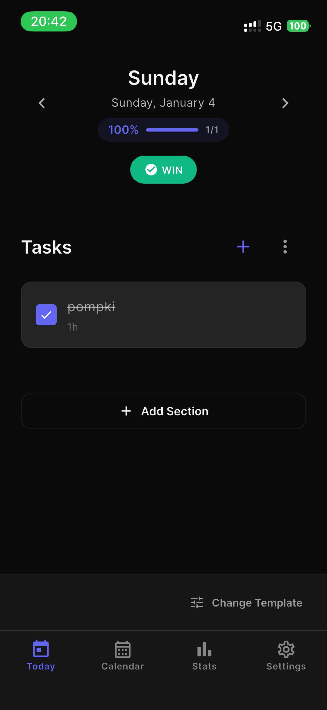
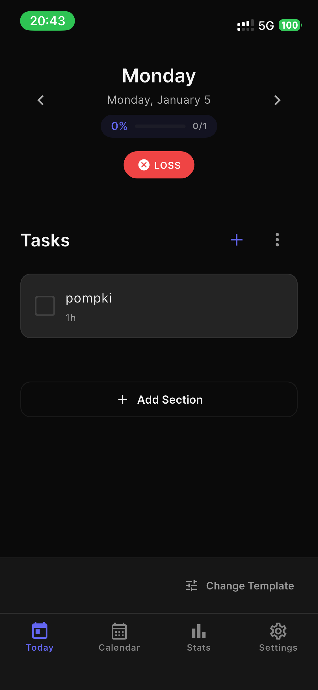
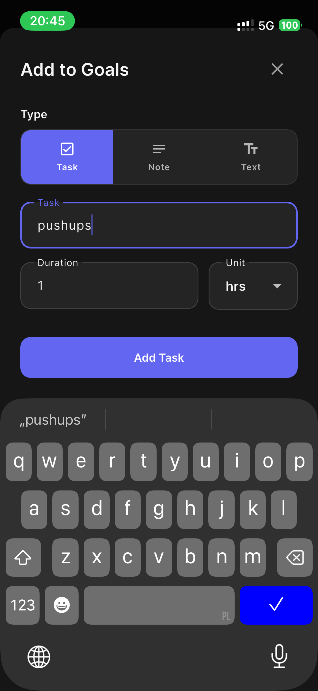
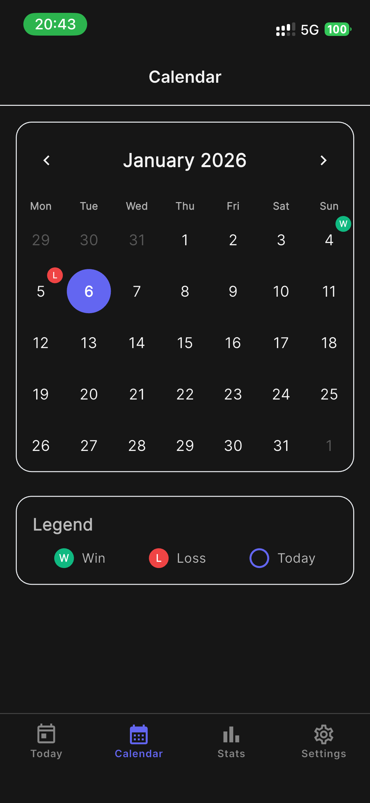
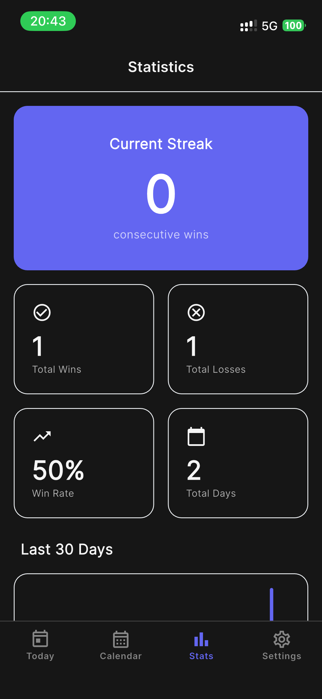

# DailyChamp

A beautiful, minimalist daily task tracker with markdown-based storage and Nextcloud sync support. Built with Flutter for iOS, macOS, Android, and Web.


## Features

### 📅 Daily Planning
- **Day Templates** - Create reusable daily structures (Weekday, Weekend, Custom)
- **Smart Sections** - Organize your day with customizable sections (Goals, Tasks, Notes, etc.)
- **Task Management** - Checkboxes with time estimates and completion tracking
- **Quick Navigation** - Browse between days with arrow navigation (← Yesterday | Today | Tomorrow →)
- **Calendar View** - Visual overview with win/loss tracking (starts on Monday)

### ✨ Intelligent Workflows
- **Auto-Apply Templates** - New days automatically get your default template
- **Swipe Actions** - Edit, delete, or copy items to tomorrow with intuitive gestures
- **Template Inheritance** - Copy items to tomorrow and carry template associations
- **Progress Tracking** - Real-time completion percentage on each day

### 🔄 Sync & Storage
- **Nextcloud Integration** - Sync your data across devices via Nextcloud
- **Markdown-Based** - All data stored in human-readable `.md` files
- **Local-First** - Works offline, syncs when connected
- **Template Sync** - Templates stored in Nextcloud for cross-device consistency

### 🎨 User Experience
- **Light/Dark Themes** - Beautiful icon-based theme selector (☀️ 🌙 ⚙️)
- **Gesture-Friendly** - Swipe to edit, delete, or copy
- **Responsive Design** - Adapts to phone, tablet, and desktop
- **No Vendor Lock-in** - Your data is yours, stored in plain markdown

## Screenshots

<table>
  <tr>
    <td><br><em>Daily View - Win</em></td>
    <td><br><em>Daily View - Loss</em></td>
    <td><br><em>Add Task</em></td>
  </tr>
  <tr>
    <td><br><em>Calendar View</em></td>
    <td><br><em>Statistics</em></td>
    <td><br><em>Settings & Sync</em></td>
  </tr>
</table>

## Getting Started

### Prerequisites

- **Flutter SDK** 3.x or higher ([Install Flutter](https://flutter.dev/docs/get-started/install))
- **Dart SDK** 3.x or higher (comes with Flutter)
- **Xcode** (for iOS/macOS development on macOS)
- **Android Studio** (for Android development)
- **Chrome** (for web development)

### Quick Setup (Recommended)

The easiest way to get started is using our automated setup script:

```bash
git clone https://github.com/gs-deliverists-io/daily-champ.git
cd daily-champ
./bin/setup
```

The setup script will:
- ✅ Install Flutter via `mise` (version manager)
- ✅ Install CocoaPods (macOS only, required for iOS/macOS builds)
- ✅ Install Flutter dependencies (`flutter pub get`)
- ✅ Verify Flutter installation

**Optional flags:**
- `./bin/setup --test` - Run tests after setup
- `./bin/setup --build` - Build app for your platform after setup

**Note:** The setup script requires:
- [gum](https://github.com/charmbracelet/gum) - For pretty terminal UI
- [mise](https://mise.jdx.dev/) - For version management
Both will be auto-installed if you have Homebrew (macOS) or pacman (Arch Linux).

### Manual Installation

If you prefer to install manually or the setup script doesn't work:

1. **Clone the repository**
   ```bash
   git clone https://github.com/gs-deliverists-io/daily-champ.git
   cd daily-champ
   ```

2. **Install dependencies**
   ```bash
   flutter pub get
   ```

3. **Verify setup**
   ```bash
   flutter doctor
   ```
   Resolve any issues reported by `flutter doctor`.

### Running the App

#### macOS
```bash
flutter run -d macos
```

#### iOS Simulator
```bash
flutter run -d ios
# Or specify simulator:
flutter run -d "iPhone 15 Pro"
```

#### Android Emulator
```bash
flutter run -d android
# Or specify device:
flutter run -d emulator-5554
```

#### Web (Chrome)
```bash
flutter run -d chrome
```

#### Web (Production Build)
```bash
flutter build web
# Output in build/web/
```

### Running Tests

```bash
# Run all tests
flutter test

# Run with coverage
flutter test --coverage

# Run specific test file
flutter test test/services/markdown_parser_test.dart
```

### Linting & Analysis

```bash
# Run static analysis
flutter analyze

# Format code
flutter format lib/ test/
```

## Configuration

### Nextcloud Sync Setup

1. **Open Settings** in the app
2. Navigate to **Connections → Nextcloud**
3. Enter your credentials:
   - **Server URL**: `https://your-nextcloud.com`
   - **Username**: Your Nextcloud username
   - **Password**: Your Nextcloud password or app-specific password
   - **Remote File Path**: `/dailychamp/daily.md` (or customize)

4. **Tap "Connect"** to verify and start syncing

#### Nextcloud File Structure
```
/dailychamp/
├── daily.md              # Your daily entries
├── templates/            # Custom templates
│   ├── weekday.md
│   ├── weekend.md
│   └── custom.md
└── backups/              # Automatic backups (optional)
```

### Templates

Templates define the structure of your daily entries. They're stored as markdown files.

#### Creating a Custom Template

**Method 1: Create Locally (macOS)**
1. Navigate to: `~/Nextcloud/Notes/dailychamp/templates/`
2. Create a new `.md` file (e.g., `focus.md`)
3. Add your structure:
   ```markdown
   ## Today's Focus
   
   ## Work
   
   ## Personal
   ```
4. The app will pick it up on next launch

**Method 2: Create on Nextcloud**
1. Log into your Nextcloud web interface
2. Navigate to `/dailychamp/templates/`
3. Create a new markdown file
4. App will sync it within 5 minutes

#### Template Format

```markdown
## Section Name
- Regular list item
- Another item

## Tasks
- [ ] Task with checkbox | 1.0h
- [ ] Another task | 2.5h

## Reflections
Free-form text goes here.
You can write multiple paragraphs.
```

#### Setting Default Template
1. Tap the template icon in Today view footer
2. Select a template
3. Tap **"Set as Default"**
4. This template will auto-apply when you open the app on a new day

#### Template Behavior
- **Navigation (← →)**: Does NOT auto-apply templates - just shows the day as-is
- **New day detected**: Auto-applies default template if today is empty
- **Copy to tomorrow**: Carries template association with the copied item

## Project Structure

```
lib/
├── main.dart                    # App entry point
├── models/                      # Data models
│   ├── daily_entry.dart
│   ├── task.dart
│   ├── section.dart
│   └── day_template.dart
├── providers/                   # State management (Provider)
│   └── dailychamp_provider.dart
├── screens/                     # UI screens
│   ├── home_screen.dart
│   ├── today_screen.dart
│   ├── calendar_screen.dart
│   ├── stats_screen.dart
│   └── settings_screen.dart
├── widgets/                     # Reusable widgets
│   ├── task_tile.dart
│   ├── add_item_sheet.dart
│   └── template_selection_dialog.dart
├── services/                    # Business logic
│   ├── file_service.dart
│   ├── markdown_parser.dart
│   ├── markdown_writer.dart
│   ├── nextcloud_sync_service.dart
│   └── template_service.dart
└── theme/                       # Styling
    └── app_theme.dart

test/
├── services/                    # Service tests
│   ├── markdown_parser_test.dart
│   └── markdown_writer_test.dart
└── widget_test.dart             # Widget tests
```

## Architecture

### Data Flow

```
User Action → Provider → Service → Storage
                 ↓
            Notifies Widgets → UI Updates
```

### Key Components

#### 1. **Provider Pattern (State Management)**
- `DailyChampProvider` manages all app state
- Uses `ChangeNotifier` to notify UI of changes
- Handles template application, task management, sync

#### 2. **Markdown Storage**
- All data stored in `daily.md` as human-readable markdown
- Parser converts markdown ↔ Dart objects
- Easy to edit manually, easy to backup

#### 3. **Template System**
- Templates define daily structure
- Stored in `templates/` directory
- Can be created locally or synced from Nextcloud
- Default template auto-applies to new days

#### 4. **Nextcloud Sync**
- Bidirectional sync with Nextcloud WebDAV
- 5-minute cache to minimize API calls
- Conflict resolution (newest wins)
- Works offline, syncs when connected

## Building for Production

### iOS

```bash
# Build IPA (requires certificates)
flutter build ios --release

# Create archive in Xcode
open ios/Runner.xcworkspace
# Product → Archive → Distribute App
```

### Android

```bash
# Build APK
flutter build apk --release

# Build App Bundle (for Play Store)
flutter build appbundle --release
```

### macOS

```bash
# Build macOS app
flutter build macos --release

# Find built app
open build/macos/Build/Products/Release/
```

### Web

```bash
# Build web app
flutter build web --release

# Deploy build/web/ to your hosting service
```

## Configuration Files

### `pubspec.yaml`
Main Flutter configuration file with dependencies and assets.

### `AGENTS.md`
Guidelines for AI-assisted development and code style.

### Platform-Specific Configs
- `ios/Runner.xcodeproj` - iOS project
- `android/app/build.gradle` - Android config
- `macos/Runner.xcodeproj` - macOS project
- `web/index.html` - Web entry point

## Contributing

Contributions are welcome! Please follow these guidelines:

1. **Fork the repository**
2. **Create a feature branch**: `git checkout -b feature/amazing-feature`
3. **Follow the code style** (see `AGENTS.md`)
4. **Write tests** for new features
5. **Run tests**: `flutter test`
6. **Run linter**: `flutter analyze`
7. **Commit changes**: `git commit -m 'Add amazing feature'`
8. **Push to branch**: `git push origin feature/amazing-feature`
9. **Open a Pull Request**

### Code Style
- Use relative imports for internal files
- Use absolute imports for packages
- Prefer `const` constructors
- Always specify return types
- Add trailing commas for multi-line statements
- See `AGENTS.md` for detailed guidelines

## Testing

The app has comprehensive test coverage:

```bash
# Run all tests with coverage
flutter test --coverage

# View coverage report
genhtml coverage/lcov.info -o coverage/html
open coverage/html/index.html
```

Current test coverage: **36 tests passing**

Test categories:
- **Unit Tests**: Markdown parser, writer, models
- **Widget Tests**: UI components

## Troubleshooting

### Common Issues

**Issue: Build fails with "pod install" error (iOS/macOS)**
```bash
cd ios
pod deintegrate
pod install
cd ..
flutter clean
flutter pub get
```

**Issue: Nextcloud sync not working**
- Verify server URL (include `https://`)
- Check username/password (try app-specific password)
- Ensure `/dailychamp/` folder exists on Nextcloud
- Check network connectivity

**Issue: Templates not showing up**
- Wait 5 minutes for cache refresh
- Restart the app
- Check template file format (must be `.md`)
- Verify templates folder path

**Issue: App crashes on startup**
```bash
flutter clean
flutter pub get
flutter run --verbose
```

### Debug Mode

Check logs:
```bash
# iOS
flutter logs

# Android
adb logcat | grep flutter

# macOS
flutter run -d macos --verbose
```

## Features in Detail

### Today View
- **Navigation**: ← Yesterday | Today | Tomorrow →
- **Progress**: Shows completion percentage
- **Sections**: Customizable sections (Goals, Tasks, Notes, etc.)
- **Swipe Gestures**: 
  - Swipe left → Edit & Delete
  - Swipe right → Copy to Tomorrow
- **Template Button**: 
  - Empty day → "Apply Template" button (inline)
  - Day with content → Small icon in footer showing template name

### Calendar View
- **Starts on Monday** (ISO 8601)
- **Color-coded days**:
  - Win days → Green background
  - Loss days → Red background
  - Today → Primary color border (never red!)
- **Legend**: Shows [W] Win, [L] Loss, [○] Today

### Stats View
- **Completion percentage** - Shows correct calculation (e.g., 100% for 1/1 tasks)
- Daily progress tracking
- Win/loss statistics

### Settings
- **Theme Selector**: Icon-based (☀️ Sun | 🌙 Moon | ⚙️ System) - full width
- **Connections**: Nextcloud configuration (credentials + sync)
- **Future**: Google Drive support (coming soon)

## Roadmap

Future enhancements being considered:

### Sync & Integration
- Google Drive sync support (alternative to Nextcloud)
- Dropbox sync support
- WebDAV generic support (any WebDAV server)
- iCloud sync for Apple ecosystem
- End-to-end encryption option

### Task Management
- Recurring tasks (daily, weekly, monthly patterns)
- Task priorities (high, medium, low)
- Task tags and categories
- Subtasks and checklists
- Task dependencies
- Time tracking and pomodoro timer

### Features
- Search functionality (full-text search across all days)
- Export to PDF/CSV/JSON
- Import from other task managers
- Markdown editor improvements (live preview, toolbar)
- Attachments support (images, files)
- Voice input for tasks
- Quick capture widget

### Platforms & UI
- iOS/Android home screen widgets
- Apple Watch companion app
- Wear OS support
- Desktop system tray icon
- Command palette (keyboard shortcuts)
- Customizable themes and colors

### Analytics & Insights
- Advanced statistics and charts
- Streak tracking and gamification
- Weekly/monthly reports
- Goal tracking over time
- Productivity insights
- Time spent analysis

### Collaboration
- Shared team templates
- Comments and notes on tasks
- Activity log and history
- Conflict resolution for synced edits

### Developer Features
- API for third-party integrations
- Webhooks for automation
- CLI tool for power users
- Browser extension
- Obsidian plugin integration

Comments, suggestions, and contributions are welcome! Open an issue to discuss new features.

## License

This project is licensed under the MIT License - see the [LICENSE](LICENSE) file for details.

## Acknowledgments

- Built with [Flutter](https://flutter.dev/)
- Markdown parsing with [flutter_markdown_plus](https://pub.dev/packages/flutter_markdown_plus)
- Swipe gestures with [flutter_slidable](https://pub.dev/packages/flutter_slidable)
- Calendar with [table_calendar](https://pub.dev/packages/table_calendar)
- State management with [Provider](https://pub.dev/packages/provider)

## Support

- **Issues**: [GitHub Issues](https://github.com/gs-deliverists-io/daily-champ/issues)
- **Discussions**: [GitHub Discussions](https://github.com/gs-deliverists-io/daily-champ/discussions)

---

Made with ❤️ and Flutter
